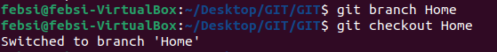
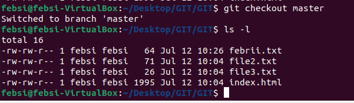
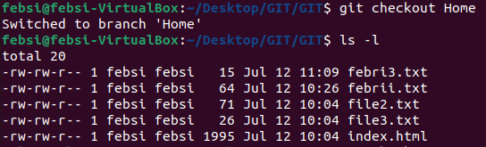
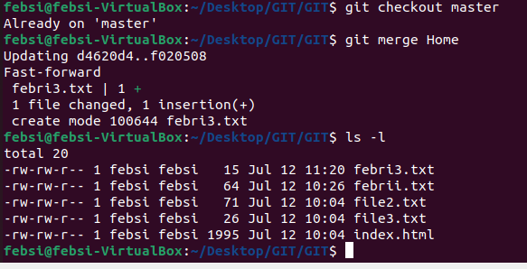
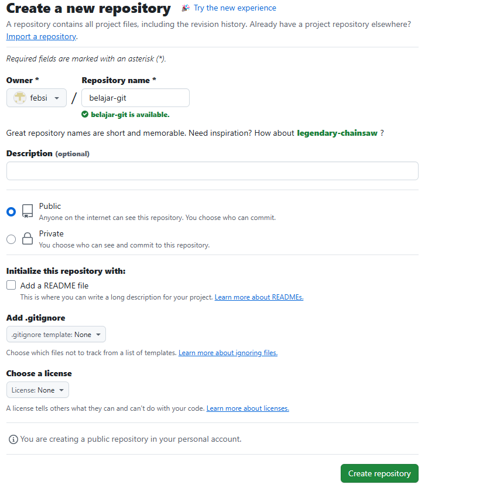
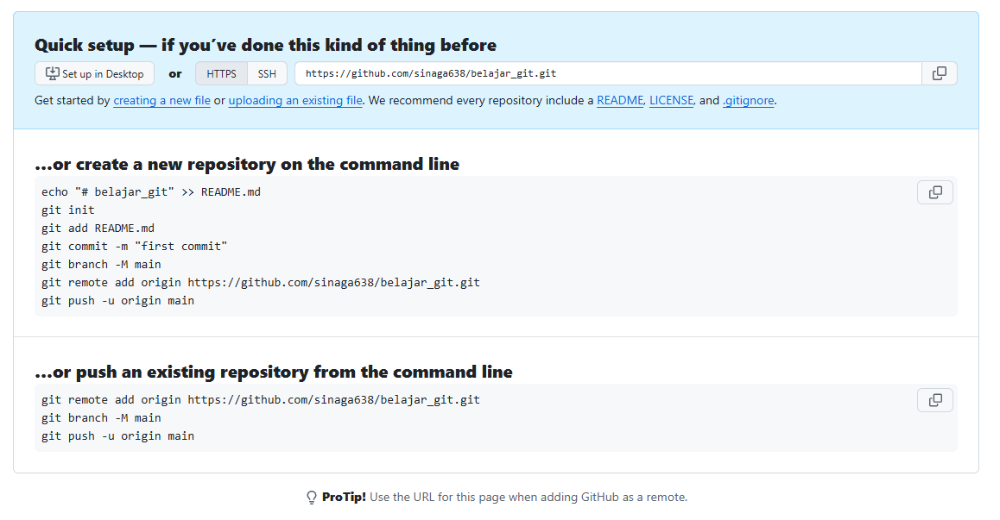
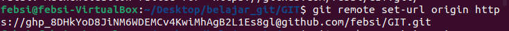
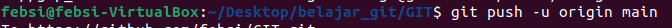
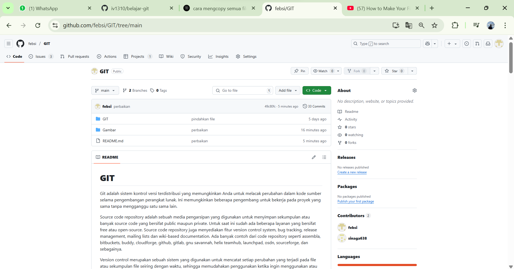

# GIT

Git adalah sistem kontrol versi terdistribusi yang memungkinkan Anda untuk melacak perubahan dalam kode sumber selama pengembangan perangkat lunak. Ini memungkinkan beberapa pengembang untuk bekerja pada proyek yang sama tanpa mengganggu satu sama lain.

Source code repository adalah sebuah media pengarsipan yang digunakan untuk menyimpan sekumpulan atau banyak source code yang bersifat public maupun private. Untuk saat ini sudah ada beberapa layanan yang bersifat free atau open-source. Source code repository juga menyediakan fitur version control system, bug tracking, release management, mailing lists dan wiki-based documentation. Ada banyak contoh dari code repository seperti assembla, bitbuckets, buddy, cloudforge, github, gitlab, gnu savannah, helix teamhub, launchpad, osdn, sourceforge, dan sebagainya.

Version control merupakan sebuah sistem yang digunakan untuk mencatat setiap perubahan yang terjadi pada file atau sekumpulan file seiring dengan waktu, sehingga memudahakan penggunakan ketika ingin menggunakan atau memeriksa versi tertentu pada waktu tertentu juga. Terdapat beberapa VCS yang telah dikembangkan, seperti bazaar, subversion(svn), mercurial, cvs, rcs, perforce, clearcase, gnu arch, gnu cssc ,dan git.

# Pre-Requisites

1. Dijalankan di github 22.04.5.
2. Instal Git version (2.34.1).
3. memiliki akun github.

# Instalasi GIT

1. untuk isntalasi git pada ubuntu 22.04.5 bisa menggunakan perintah.
    ```bash
     sudo apt-get Update
     sudo apt-get install git
     ```

2. Setalah melakukan intsall, coba cek versi git dengan perintah berikut.
    ```bash
     git --version
     ```
    

3. kemudia kita tambah identitas username dan email yang akan dikenali oleh git.
    - username 
    ```bash
     git config --global user.name "nama anda" 
     ```
    - email
     ```bash
     git config --global user.email "email anda" 
     ```

4. untuk melihat penambahan identitas berhasil dapat kita lihat dengan perintah.
    
    ```bash
     git config --list --show-origin 
     ```
    

# Perintah dasar Git

Dalam pembuatan git ada tiga bagian yang harus dilewati.
    
- Working Directory adalah tempat kita bekerja langsung pada file dan perubahan di bagian ini belum tercatat atau dilacak oleh Git.
- Staged Area ini adalah tempat dimana kita menyimpan file yang ingin di masukan kedalam repository.
- Repository adalah tempat penyimpanan akhir dari file atau proyrk yang sduah dikelolah oleh Git. Repository bisa berupa Local Repository(Di Komputer kita) atau Remote Repository(Github)
 
langkah-langkah Git.

- inisialisasi Repositori baru:
    ```bash
     git init 
     ```

- menambahkan file ke Staged Area.
    ```bash
     git add <nama file> 
     ```
    
        
- melakukan commit atau memasukan ke dalam repository local kita.
    ```bash
     git commit -m "Pesan commit"
     ```
    
        
- melihat history commit yang sudah dilakukan.
    ```bash
     git init 
     ```
    


# Pembuatan Branch

Branch berguna untuk mengindari konflik ketika melakukan kolaborasi pada saat mengerjakan suatu proyek secara berkelompuk.

untuk membuata branch dapat kita lakukan dengan command berikut.
    ```bash
        git branch <namabranch>
    ```

untuk berganti branch kita dapat menggunakn command.
    ```bash
    git checkout <namabranch>
     ```
    

check directory pada branch home dan master untuk melihat perbedaan directory.

- branch Master



- branch Home




lalu untuk menyatukan perubahan dapat dilakukan perintah.
    ```bash
     git checkout master
     git merge <namabranch>
    ```



# Push Respository Local ke Repository Github
 
Dalam pengerjaan proyrk tidak mungkin hanya menyimpan proyek dalam repository lokal saja.Kemudian untuk mengabungkannya digunakan repository inti atau remote yang akan menyimpan semua source code atau proyek yang telah dikerjakan setiap orang. Kemudian untuk mengabungkannya digunakan repository inti atau remote yang akan menyimpan semua source code atau proyek yang telah dikerjakan setiap orang.

- Membuat Repository baru Di Github.



- Selanjutnya keti command yang ada di gambar agar kita dapat memasukan file ke dalam repository di github.



- cara menghubungkan Repository lokal dengan repository remote, terlebih dahulu harus ditambahkan remotenya dengan bantuan perintah.

    ```bash
     git remote set-url origin https://<token>@github.com/<user>/<repo>
    ```



- setelah berhasil di remote kita push file yang ada di directory kita dengan perintah.

    ```bash
     git push -u origin main
    ```



dapat kita lihat repository yang sudah di push di akun github kita.

